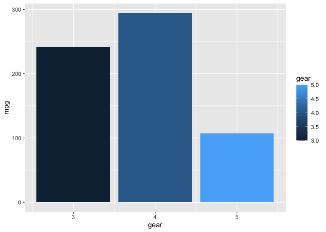
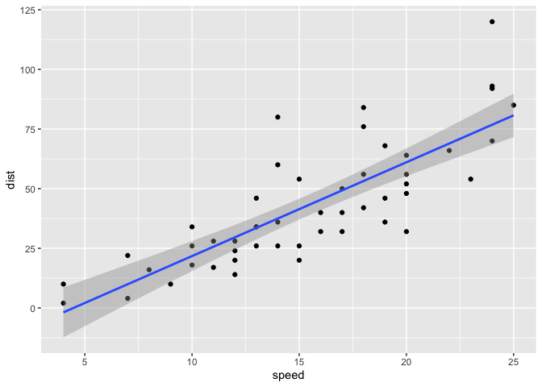
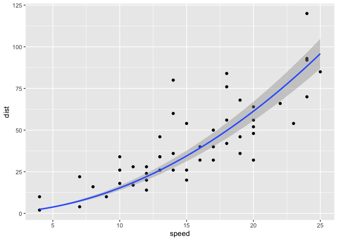

Advanced Bioinformatics 2019 Assignment
================
p1405792
03/05/2020

Task 1

``` r
x <- seq(by=1, from=5, to=55); sum(x)
```

    ## [1] 1530

I used the x \<- function to make x the sequence The sequence used by=1
to ensure the sequence space meant that the values were all integers By
using from=5, to=55 the sequence was established as all integeres
between 5 and 55 sum(x) then allowed for the sum of all the numbers in
the sequence represented by x

Task 2

``` r
sumfun <- function(n) {
  answer <- sum(seq(by=1, from=5, to=n))
return(answer)}
sumfun(10)
```

    ## [1] 45

``` r
sumfun(20)
```

    ## [1] 200

``` r
sumfun(100)
```

    ## [1] 5040

To create the sumfun function I made n the variable being used with the
result of the function under the moniker answer sumfun would then run
the sum of a sequence of intergers (by=1) starting at 5 (from=5) until
the sequence reached the variable n (to=n) To get the answers I used the
sumfun function where n=10, then n=20, then n=100

Task 3

``` r
n <- 12
fib <- numeric(n)
fib[1] <- 1
fib[2] <- 1
for (i in 3:n)
{
  fib[i] <- fib[i-1]+fib[i-2]
}
fib
```

    ##  [1]   1   1   2   3   5   8  13  21  34  55  89 144

  - by stating that n \<- 12 when running fib you will get the first 12
    numbers of the sequence
  - the first 2 numbers are 1 so need to be set seperately to the rest
    of the for loop
  - by using for (i in 3:n) you establish that the loop applys to
    integers between 3 and n
  - fib\[1\] \<- fib\[i-1\]+fib\[i-2\] establishes that each integer is
    the value of the previous two places in the sequence added together

Task
    4

``` r
library(ggplot2)
```

    ## Warning in as.POSIXlt.POSIXct(Sys.time()): unknown timezone 'zone/tz/2019c.1.0/
    ## zoneinfo/Europe/London'

``` r
ggplot(data=mtcars,aes(x=gear, y=mpg, fill=gear)) + geom_bar(stat="identity")
```

<!-- -->
Using dat=mtcars established mtcars as the data set that the values
would be taken from x=gear established the x axis as valued by the
number gear y=mpg established the y axis as valued by the mpg of the car
fill= gear established different colour fills on the bars differentiated
by gear geom\_bar established the graph type as a bar graph
stat=“identity” meant that the height of the bars were mapped to the
value of the y axis at that location on the x axis

Task 5

``` r
linearmodel <- lm(dist ~ speed, data=cars)
summary(linearmodel)
```

    ## 
    ## Call:
    ## lm(formula = dist ~ speed, data = cars)
    ## 
    ## Residuals:
    ##     Min      1Q  Median      3Q     Max 
    ## -29.069  -9.525  -2.272   9.215  43.201 
    ## 
    ## Coefficients:
    ##             Estimate Std. Error t value Pr(>|t|)    
    ## (Intercept) -17.5791     6.7584  -2.601   0.0123 *  
    ## speed         3.9324     0.4155   9.464 1.49e-12 ***
    ## ---
    ## Signif. codes:  0 '***' 0.001 '**' 0.01 '*' 0.05 '.' 0.1 ' ' 1
    ## 
    ## Residual standard error: 15.38 on 48 degrees of freedom
    ## Multiple R-squared:  0.6511, Adjusted R-squared:  0.6438 
    ## F-statistic: 89.57 on 1 and 48 DF,  p-value: 1.49e-12

Intercept: -17.5791 Std Error: 6.7584 Slope: 3.9324 feet/mph Std Error:
0.4155

I used dist as the y axis as it’s the uncontrolled variable Speed was
used as the x axis as it was the controlled variable data=cars was used
to retrieve the data used

Task 6

``` r
library(ggplot2)
ggplot(cars,aes(x=speed, y=dist)) + geom_point() + geom_smooth(method = lm, formula = y ~ x)
```

<!-- -->
ggplot(cars,aes( allowed me to draw from the cars data for the plot
x=speed set car speed as the x axis as this was a controlled value
y=dist set breaking distance as the y axis as this was the uncontrolled
value geom\_point() meant that the data was plotted in a scatter graph
geom\_smooth added a straight line to the graph method = lm allowed me
to use the linear model to predict the line function = y ~ x controlled
the way that the lm function used the data

Task 7

``` r
reactiontimemod <- lm(dist ~ I(speed^2)+0, data = cars)
summary(reactiontimemod)
```

    ## 
    ## Call:
    ## lm(formula = dist ~ I(speed^2) + 0, data = cars)
    ## 
    ## Residuals:
    ##     Min      1Q  Median      3Q     Max 
    ## -29.350  -7.988   1.325   8.080  49.939 
    ## 
    ## Coefficients:
    ##            Estimate Std. Error t value Pr(>|t|)    
    ## I(speed^2) 0.153374   0.007122   21.54   <2e-16 ***
    ## ---
    ## Signif. codes:  0 '***' 0.001 '**' 0.01 '*' 0.05 '.' 0.1 ' ' 1
    ## 
    ## Residual standard error: 15.61 on 49 degrees of freedom
    ## Multiple R-squared:  0.9044, Adjusted R-squared:  0.9025 
    ## F-statistic: 463.8 on 1 and 49 DF,  p-value: < 2.2e-16

``` r
x <- mean (residuals(reactiontimemod))
y <- mean (((cars$speed)/3600)*5280)
x/y
```

    ## [1] 0.1064097

I created a lm that fitted the distance proportionally to the speed
squared with an intercept of 0 (car isn’t moving so should have no break
distance) Using this lm and the residuals to calculate a mean reaction
distance which I labelled as x I then used a mean value of the speed
(diveded by 3600 and multiplyed by 5280 to convert the speed from mph to
feet per second) of the driver which became y x/y therefore is = to the
reaction time

``` r
library(ggplot2)
ggplot(cars,aes(x=speed, y=dist)) + geom_point() + geom_smooth(method = lm, formula = y ~ I(x^2) + 0)
```

<!-- -->
